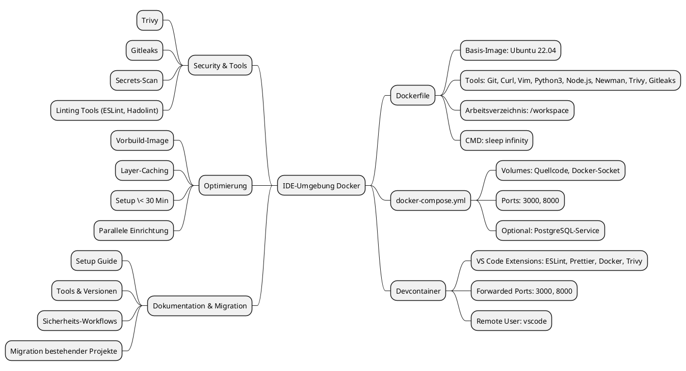

<!-- @import "[TOC]" {cmd="toc" depthFrom=1 depthTo=6 orderedList=false} -->

<!-- code_chunk_output -->

- [Modul2-Dockervscode-github.md](#modul2-dockervscode-githubmd)
- [Prompt](#prompt)
- [Aufbau des Dockerfiles 📦](#aufbau-des-dockerfiles-)
- [Security-Tools (CVE- und Schwachstellenprüfung):](#security-tools-cve--und-schwachstellenprüfung)
  - [Volumes \& Arbeitsverzeichnis](#volumes--arbeitsverzeichnis)
  - [Ports](#ports)
  - [Nicht im Container enthalten](#nicht-im-container-enthalten)
- [Verwendung von Docker Compose 🗂️](#verwendung-von-docker-compose-️)
  - [PostgreSQL-Container hinzufügen:](#postgresql-container-hinzufügen)
- [Automatisierung mit Devcontainer ⚙️](#automatisierung-mit-devcontainer-️)
  - [Basis-Image oder Dockerfile:](#basis-image-oder-dockerfile)
  - [VS Code Extensions:](#vs-code-extensions)
    - [Trivy-Scans](#trivy-scans)
    - [VS Code Einstellungen:](#vs-code-einstellungen)
    - [Port-Forwarding und weitere Konfigurationen:](#port-forwarding-und-weitere-konfigurationen)
    - [Die Devcontainer-Automatisierung](#die-devcontainer-automatisierung)
    - [Zusammengefasst standardisiert der Devcontainer-Ansatz](#zusammengefasst-standardisiert-der-devcontainer-ansatz)
      - [VS Code und Docker abstrahieren das weg,](#vs-code-und-docker-abstrahieren-das-weg)
- [Ergänzende Tools für Sicherheit und Code-Qualität 🔐🛠️](#ergänzende-tools-für-sicherheit-und-code-qualität-️)
  - [CVE-Scan und Dependency-Management:](#cve-scan-und-dependency-management)
    - [npm audit und pip audit](#npm-audit-und-pip-audit)
  - [Linting und Formatierung:](#linting-und-formatierung)
  - [Secrets-Scanning:](#secrets-scanning)
  - [Testing-Frameworks und Pipeline-Integration:](#testing-frameworks-und-pipeline-integration)
    - [Zusammengefasst](#zusammengefasst)
- [Optimierungen für schnelle Einrichtung 🚀](#optimierungen-für-schnelle-einrichtung-)
  - [Vorbuild-Images nutzen](#vorbuild-images-nutzen)
  - [Layer-Caching ausnutzen](#layer-caching-ausnutzen)
  - [Downloads minimieren:](#downloads-minimieren)
  - [Caching von Paket-Managern](#caching-von-paket-managern)
  - [Parallele Einrichtung](#parallele-einrichtung)
  - [Schlankheitskur fürs Image](#schlankheitskur-fürs-image)
    - [Mit diesen Maßnahmen](#mit-diesen-maßnahmen)
  - [Usage Guide](#usage-guide)
  - [Inhalt der Dev-Umgebung](#inhalt-der-dev-umgebung)
  - [Sicherheits-Workflows](#sicherheits-workflows)
  - [Migration bestehender Projekte](#migration-bestehender-projekte)
  - [Limitierungen \& Ausschlüsse](#limitierungen--ausschlüsse)
  - [Abschließend empfiehlt es sich](#abschließend-empfiehlt-es-sich)
- [Mindmap](#mindmap)

<!-- /code_chunk_output -->


# Modul2-Dockervscode-github.md


# Prompt
```bash
ich lade dir die Projektcharter als Mindmap hoch
```


Danke für die Projekt-Charter-Mindmap zur IDE-Umgebung. Ich analysiere die Informationen, um ein geeignetes Dockerfile für die Umsetzung des Projekts zu erstellen. Außerdem werde ich sinnvolle Vorschläge zur technischen Umsetzung und zu Verbesserungen machen.
Ich melde mich bald mit den Ergebnissen. Du kannst mir in der Zwischenzeit gern weitere Informationen oder Wünsche mitteilen.Research completed in 16m· 10 Quellen· 68 SuchenDockerfile:
```dockerfile
# Basis-Image: schlankes Ubuntu LTS für breite Kompatibilität
FROM ubuntu:22.04

# Aktualisieren der Paketquellen und Installation grundlegender Tools und Laufzeiten
RUN apt-get update && apt-get install -y \
    git curl wget gnupg2 ca-certificates apt-transport-https lsb-release \
    python3 python3-pip build-essential vim docker.io \
    && rm -rf /var/lib/apt/lists/*

# Node.js (für z.B. Newman CLI) – Installation der aktuellen LTS-Version über NodeSource
RUN curl -fsSL https://deb.nodesource.com/setup_18.x | bash - \
    && apt-get install -y nodejs \
    && npm install -g newman   # Newman: CLI für Postman-Collections

# Trivy installieren (CVE-Scanner für Container/Dateien)
RUN apt-get install -y apt-transport-https gnupg \
    && curl -fsSL https://aquasecurity.github.io/trivy-repo/deb/public.key | apt-key add - \
    && echo "deb https://aquasecurity.github.io/trivy-repo/deb $(lsb_release -sc) main" > /etc/apt/sources.list.d/trivy.list \
    && apt-get update && apt-get install -y trivy

# (Optional) Gitleaks installieren (Secret-Scanning als eigenständiges Binary)
RUN wget -O /usr/local/bin/gitleaks https://github.com/gitleaks/gitleaks/releases/latest/download/gitleaks-linux-amd64 \
    && chmod +x /usr/local/bin/gitleaks

# Arbeitsverzeichnis einrichten
WORKDIR /workspace

# (Optional) Vorkonfigurierte VS Code Settings/Extensions ins Image kopieren
# COPY .devcontainer/settings.json /home/vscode/.vscode-remote/data/Machine/settings.json

# Container im Leerlauf halten (oder alternativ Start einer Shell)
CMD ["sleep", "infinity"]
```

docker-compose.yml (optional):


```yaml
version: "3.9"
services:
  dev:
    build: .                      # Image aus dem Dockerfile bauen
    container_name: ide-dev       # Verständlicherer Name für den Container
    volumes:
      - .:/workspace              # Quellcode ins Container-Arbeitsverzeichnis einbinden
      - /var/run/docker.sock:/var/run/docker.sock   # Docker-Socket für Docker-in-Docker Zugriff
    ports:
      - "3000:3000"               # Beispiel: Port 3000 forwarden
      - "8000:8000"               # Beispiel: Port 8000 forwarden
    # user: "1000:1000"           # Optional: Container als nicht-root User starten (IDs anpassen)
    # environment:
    #   - NODE_ENV=development    # Beliebige Umgebungsvariablen
```

#  Aufbau des Dockerfiles 📦
Im Dockerfile oben wird zunächst ein Ubuntu 22.04 LTS Basis-Image gewählt. Dieses bietet breite Kompatibilität und Security-Updates und läuft einheitlich auf Linux, macOS (via Docker Desktop) und Windows (via Docker Desktop/WSL2), einschließlich Multi-Arch-Unterstützung (amd64/arm64). Alternativ könnte man auch ein offizielles Devcontainer-Basisimage nutzen – z. B. das “vscode/devcontainers/universal”-Image – welches bereits viele Werkzeuge mitbringthub.docker.com. Dadurch wäre das Image zwar größer, aber auf verschiedenen Plattformen lauffähig und mit vorinstallierten Tools.
Grundlegende Tools und Abhängigkeiten: Über apt-get installieren wir gängige Entwickler-Werkzeuge und Bibliotheken. Dazu gehören u.a. Git für Versionsverwaltung, Curl/Wget für Downloads, sowie Build-Essentials (Compiler, Make) für das Bauen nativer Abhängigkeiten. Auch Python 3 inkl. Pip ist enthalten, da viele Projekte Skripte oder Tools in Python nutzen. Falls nötig könnten hier ebenso Laufzeiten wie Java oder .NET ergänzt werden – je nach stack des Teams – wobei man zur Optimierung nicht benötigte Komponenten weglassen sollte. Im Beispiel installieren wir auch einen Editor (vim) für einfache Dateibearbeitung im Container.
Docker-Integration innerhalb des Containers: Um aus dem Container heraus weitere Container zu bauen oder zu starten (z.B. für Tests oder lokale Dienste), ist Docker CLI im Container installiert (docker.io). Durch das Binden des Docker-Sockets (/var/run/docker.sock) vom Host in den Container erhält der Container Zugriff auf den Host-Daemoncode.visualstudio.com. Dies vermeidet einen vollwertigen „Docker-in-Docker“-Dienst und ermöglicht sichere Image-Builds und -Scans innerhalb der Dev-Umgebung. (Hinweis: Diese Methode bringt potentielle Sicherheitsrisiken mit sich, da der Container vollen Zugriff auf Docker hat – in einer vertrauenswürdigen Dev-Umgebung ist das jedoch meist akzeptabel.)
VS Code Konfiguration: Anstatt VS Code selbst im Container zu installieren (der Entwickler nutzt ja seinen lokalen VS Code mit Remote-Zugriff), werden im Dockerfile keine VS Code-Binaries benötigt. Stattdessen kann man vorkonfigurierte Settings und Erweiterungen bereitstellen. Im Beispiel ist gezeigt, wie man optional eine settings.json oder andere Konfigurationsdateien in das Container-Dateisystem kopieren könnte (z.B. unter /home/vscode/... falls ein entsprechender User existiert). Üblicher ist jedoch, diese Konfiguration über einen Devcontainer zu steuern (siehe unten). Die VS Code Einstellungen könnten Dinge umfassen wie einheitliche Formatierungsregeln, Linting-Einstellungen etc., und Empfehlungslisten von Extensions, damit alle Entwickler die gleichen Tools nutzen.
API-Testing Tools: Das Dockerfile installiert zwei wichtige CLI-Tools für API-Tests: Newman und optional die Insomnia CLI (Inso). Newman ist das offizielle Kommandozeilen-Tool von Postman, mit dem sich Postman Collections headless ausführen lassengithub.com. Im Dockerfile wird Newman via npm global installiert (npm install -g newman), nachdem Node.js (hier über NodeSource auf Version 18 LTS) eingerichtet wurde. Damit können Entwickler oder CI-Pipelines API-Tests und Collection-Runs direkt im Container ausführen (z.B. newman run collection.json). Für Insomnia bietet Kong eine CLI namens “Inso”. Diese ließe sich ähnlich hinzufügen – etwa durch Download des Binaries oder via npm/Homebrew. Inso ermöglicht es, Insomnia-Funktionen per Terminal/CI zu nutzendeveloper.konghq.com, z. B. automatisierte Testläufe und Linting von API-Spezifikationen. (Ein Beispiel: inso run test "<Dokumentname>" --env "<Umgebung>" führt definierte Tests einer Insomnia-Sammlung ausdeveloper.konghq.com.) Da Postman und Insomnia primär GUI-Tools sind, macht die Einbindung ihrer CLI-Versionen im Container die Umgebung skript- und CI-freundlich, ohne auf die GUIs angewiesen zu sein.

# Security-Tools (CVE- und Schwachstellenprüfung): 
Eine zentrale Anforderung ist die integrierte Sicherheitsprüfung. Im Dockerfile wird daher Trivy installiert. Trivy ist ein populärer Open-Source Scanner, der Container-Images und Dateisysteme bzw. Projektabhängigkeiten auf bekannte Schwachstellen (CVEs) und Fehlkonfigurationen prüfen kannaquasec.com. Über trivy lassen sich z.B. Basis-Images oder Dependency-Dateien (pom.xml, package-lock.json etc.) automatisch auf CVEs prüfen. Zusätzlich wird im Beispiel Gitleaks eingebunden – ein Tool, das den Code auf Hardcoded Secrets (Tokens, Passwörter etc.) scannt. Gitleaks kann sehr einfach als einzelnes Binary installiert werdengithub.com, wie im Dockerfile per wget demonstriert (alternativ wäre auch ein TruffleHog-Scan möglich; beide haben ähnliche Funktion). Diese Tools laufen im Container und können z.B. via CI oder pre-commit Hooks angestoßen werden, um Sicherheitsprobleme frühzeitig zu entdecken.
## Volumes & Arbeitsverzeichnis
Im Dockerfile setzen wir WORKDIR /workspace – dieses Verzeichnis dient als Mount-Point für den Quellcode der Projekte. In der Compose-Datei wird das aktuelle Projektverzeichnis vom Host genau dort eingehängt. So arbeiten Entwickler im Container direkt mit den Host-Dateien, was schnellen Dateiabgleich ermöglicht. Zusätzlich könnten weitere Volumes definiert werden, etwa um Build-Caches oder Tool-Konfigurationen (npm Cache, Maven Repository etc.) persistent zu halten und den Aufbau zu beschleunigen. Solche Caches liegen oft in Home-Verzeichnissen – man könnte sie via Volume mounten, damit z.B. beim nächsten Container-Start Bibliotheken nicht erneut komplett heruntergeladen werden müssen.

## Ports
Damit Web-Apps, APIs oder andere Dienste im Container vom Host aus erreichbar sind, werden im Compose-Beispiel Ports veröffentlicht (3000, 8000 als typische Entwicklungsports). Diese können je nach Projekt angepasst oder um weitere ergänzt werden. Durch VS Code Devcontainer-Konfiguration lassen sich Ports auch automatisch forwarden code.visualstudio.com, sodass der Entwickler in VS Code eine Benachrichtigung erhält und die laufende App im Browser öffnen kann.
## Nicht im Container enthalten
Wie im Projekt-Charter definiert, sind zentrale Infrastruktur-Komponenten wie SSO/Identity-Management oder globales Lizenzmanagement nicht Teil der Container-Umgebung. Diese würden in der Regel außerhalb gehandhabt (z.B. durch bestehende Unternehmens-SSO in der IDE nutzen, nicht aber im isolierten Devcontainer). Das Dockerfile fokussiert sich daher auf die Entwicklungs- und Sicherheitstools und verzichtet bewusst auf SSO-Agents o.ä.

# Verwendung von Docker Compose 🗂️
Der Einsatz einer docker-compose.yml (bzw. im neueren Docker eine docker compose Datei) ist insbesondere dann sinnvoll, wenn die Entwicklungsumgebung aus mehreren Container-Diensten besteht. Im einfachsten Fall reicht zwar der einzelne IDE-Container, aber viele Projekte benötigen zusätzliche Services zur Entwicklungszeit – z. B. eine lokale Datenbank, ein Message-Broker oder ähnliche Abhängigkeiten. Mit Docker Compose können solche Dienste gemeinsam mit der IDE-Umgebung definiert und gestartet werden. So könnte man etwa einen 
## PostgreSQL-Container hinzufügen:

```yaml
services:
  dev: ...  # (wie oben)
  db:
    image: postgres:15-alpine
    environment:
      - POSTGRES_PASSWORD=example
    volumes:
      - db-data:/var/lib/postgresql/data
volumes:
  db-data:

```
Dieses Beispiel würde beim docker-compose up automatisch einen Datenbank-Service bereitstellen, den man aus der Dev-Umgebung heraus ansprechen kann (Hostnamen entsprechen dem Servicenamen, hier db). Compose erleichtert also das Orchestrieren komplexerer Dev-Setups. VS Code’s Devcontainer-Feature unterstützt es ebenfalls, bestehende Compose-Umgebungen zu nutzen oder zu erweiterncode.visualstudio.com. In einer devcontainer.json kann man referenzieren, dass statt eines einzelnen Dockerfiles eine docker-compose.yml genutzt wird, um mehrere Container bereitzustellencode.visualstudio.com. So bleibt die Entwicklungserfahrung konsistent, auch wenn z.B. eine Datenbank oder ein Mock-API-Server dazugehören – die komplette Umgebung wird per Compose definiert und einheitlich gestartet.
Im Compose-Beispiel oben sieht man auch das Binden des Docker-Sockets (/var/run/docker.sock). Dies ist nötig, damit der im dev-Container installierte Docker-Client mit dem Docker-Daemon des Hosts kommunizieren kann. So könnte man z.B. im VS Code Terminal innerhalb des Containers einen Befehl docker build oder docker run ausführen – in Wirklichkeit steuert man damit den Docker auf dem Host (die Container werden also vom Host-Docker gestartet). Dieses Muster (“Docker-from-Docker”) ist gängig, um z.B. in CI-Pipelines oder Devcontainern Container zu bauen, ohne Docker auf allen Plattformen separat installieren zu müssencode.visualstudio.com. Sollte vollständige Isolierung nötig sein, könnte man stattdessen Docker-in-Docker einsetzen (d.h. den Docker Daemon im Container laufen lassen), was jedoch die Komplexität erhöht und meist nicht erforderlich ist.
Zusammengefasst hilft Docker Compose also dabei, die gesamte Arbeitsumgebung als Stack zu definieren. Entwickler können mit einem Befehl (docker-compose up) alle nötigen Komponenten hochfahren. In Kombination mit VS Code Devcontainer werden diese Schritte sogar automatisiert im Hintergrund durchgeführt, sobald man das Projekt in VS Code öffnet – inkl. Build des Images, Start aller Container und Verbinden der IDE.

# Automatisierung mit Devcontainer ⚙️
Um die Einrichtung der IDE-Umgebung weiter zu vereinfachen, bietet sich die Verwendung von VS Code Devcontainer-Konfigurationsdateien an. Ein Devcontainer besteht aus einer Datei devcontainer.json (meist in einem .devcontainer-Verzeichnis im Projekt) plus dem Dockerfile bzw. Compose File. Diese Datei beschreibt, wie VS Code den Container bauen und starten soll und welche Einstellungen danach geltencode.visualstudio.com. Beim Öffnen des Projekts erkennt die VS Code Remote-Containers Erweiterung diese Datei und übernimmt automatisch den Aufbau der Umgebung. Dadurch reicht ein Klick auf „Reopen in Container“ und der komplette Entwicklungsstack wird bereitgestelltcode.visualstudio.com.
In der devcontainer.json können verschiedene Aspekte definiert werden:


## Basis-Image oder Dockerfile: 
Man kann entweder ein fertiges Image angeben oder – wie in unserem Fall – auf das Dockerfile verweisen, damit VS Code es baut. Beispiel:
```json
"build": { "dockerfile": "Dockerfile" }
```

Optional kann hier auch ein Docker Compose Setup referenziert werden, falls mehrere Services gestartet werden sollen. Devcontainer ermöglicht es, eine vorhandene Compose-Datei weiterzuverwendencode.visualstudio.com, was nahtlos mit komplexeren Umgebungen funktioniert.


## VS Code Extensions: 
Man kann eine Liste von Erweiterungen angeben, die automatisch im Container installiert bzw. im verbundenen VS Code aktiviert werden. So stellt man sicher, dass z.B. ESLint, Prettier, Docker und andere wichtige Extensions überall vorhanden sind. Im Devcontainer-File würde das z.B. so aussehen:

```json
"customizations": {
  "vscode": {
    "extensions": [
       "dbaeumer.vscode-eslint",
       "esbenp.prettier-vscode",
       "ms-azuretools.vscode-docker",
       "aquasecurity.trivy-vscode" 
    ]
  }
}

```

Hier würden die ESLint- und Prettier-Linter, die Docker-Integration sowie z.B. die Trivy Extension automatisch eingerichtet. Letztere bringt 
### Trivy-Scans 
direkt ins VS Code UIaquasec.com, sodass Sicherheitsprüfungen in Echtzeit im Editor stattfinden können. (Die Trivy VS Code Extension erlaubt u.a. das Scannen von Code und Dependencies auf Schwachstellen und zeigt Ergebnisse im „Problems“-Panel anaquasec.comaquasec.com.)


### VS Code Einstellungen: 
Mit dem Feld "settings" können projektspezifische VS Code Settings vorgegeben werden – z.B. einheitliche Formatierungseinstellungen, Tab-Größen, oder Pfade zu Tool-Binaries im Container. Diese Einstellungen werden nur wirksam, wenn man im Devcontainer arbeitet, und überschreiben dort die Benutzer-Settings. So kann man z.B. sicherstellen, dass die IDE im Container immer den korrekten Python-Interpreter verwendet, oder dass bestimmte Linter-Warnungen unterdrückt/aktiviert sind.


### Port-Forwarding und weitere Konfigurationen: 
Devcontainer erlaubt, Ports zu definieren, die automatisch vom Container nach außen freigegeben werden (ähnlich wie in docker-compose). Im obigen Beispiel könnten wir "forwardPorts": [3000, 8000] setzen, damit VS Code diese Ports tunneltcode.visualstudio.com. Man kann auch Startkommandos definieren (etwa automatisch npm install ausführen lassen) oder Umgebungsvariablen setzen. Sogar das Anlegen eines Nicht-Root-Users im Container kann in devcontainer.json konfiguriert werden. Beispielsweise kann "remoteUser": "vscode" gesetzt werden, sofern das Dockerfile einen entsprechenden Nutzer erstellt hat. Dies erhöht die Sicherheit, da man nicht als Root entwickelt – alle offiziellen Devcontainer-Images von Microsoft kommen daher schon mit einem vscode User. Unser eigenes Dockerfile könnte man leicht erweitern: einen User erstellen (RUN useradd -m vscode && usermod -aG sudo vscode) und USER vscode setzen. Damit laufen IDE und Tools im Container unter eingeschränkten Rechten, was besonders wichtig ist, wenn z.B. Webserver im Container laufen.


### Die Devcontainer-Automatisierung
bringt mehrere Vorteile: Neue Entwickler müssen nicht manuell Docker-Befehle ausführen oder Einstellungen importieren – ein Checkout des Repos und „im Container öffnen“ genügen, alles andere passiert skriptgesteuert. Außerdem können Änderungen an der Umgebung versioniert werden (Änderungen am Dockerfile oder der devcontainer.json werden mit dem Projekt geteilt). Dokumentation zur Projektumgebung kann direkt im Repository liegen (etwa in der README oder einem docs/-Ordner), was die Onboarding-Zeit reduziert.

### Zusammengefasst standardisiert der Devcontainer-Ansatz
die Entwicklungsumgebung als Teil des Projekts. Das passt zum Ziel der einheitlichen IDE-Umgebung, weil alle Beteiligten genau die gleiche konfigurationsgeprüfte Umgebung nutzen. Unterschiedliche Host-Betriebssysteme sind dabei kein Problem – 
#### VS Code und Docker abstrahieren das weg, 
sodass ein Mac-User, Windows-User oder Linux-User stets die gleichen Versionen von Tools und Libraries im Container vorfindetcode.visualstudio.comhub.docker.com.

# Ergänzende Tools für Sicherheit und Code-Qualität 🔐🛠️
Über die bereits integrierten Tools hinaus gibt es weitere Möglichkeiten, die Entwicklungsumgebung abzusichern und qualitativ zu verbessern:


## CVE-Scan und Dependency-Management: 
Wir haben Trivy bereits als Container-/Dependency-Scanner eingebunden. Dieses Tool kann in CI-Workflows genutzt werden, um bei jedem Build automatisch auf bekannt gewordene Schwachstellen zu prüfen. Es ist ratsam, hierfür einen regelmäßigen Scan (z.B. per GitHub Action oder Jenkins Pipeline) einzurichten, der entweder das erstellte Docker-Image scannt oder direkt Quellcode/Lockfiles analysiert. Zusätzlich könnten sprachspezifische Scanner eingesetzt werden: z.B. 
### npm audit und pip audit
für Node/Python Abhängigkeiten oder OWASP Dependency-Check für Java-Projekte. Diese können ebenfalls im Container laufen. Wichtig ist, die Ergebnisse der Scans dem Entwickler früh rückzumelden – idealerweise schon beim Coding. Hier kommen VS Code Extensions ins Spiel (Trivy Extension hatten wir erwähnt). Ebenfalls nützlich: Snyk bietet VS Code Plugins und CLI-Tools, um Dependencies auf CVEs zu prüfen. Da Snyk allerdings ein cloud-gestütztes Tool ist, haben wir uns im Open-Source-Kontext auf Trivy/Dependency-Check beschränkt.


## Linting und Formatierung: 
Einheitlicher Code-Stil und Erkennen von Fehlern schon zur Entwicklungszeit sind Kern eines produktiven Teams. In der Container-IDE sollten daher relevante Linters/Formatter vorhanden sein. Viele davon kommen als VS Code Erweiterung (z.B. ESLint, Pylint, Prettier, Black, GoFmt etc.), manche auch als CLI. Wir könnten z.B. ESLint global via npm installieren oder einfach die VS Code ESLint-Extension in den Devcontainer laden (letzteres ist vorzuziehen, da ESLint meist projektspezifisch mit bestimmten Versionen läuft). Für Infrastruktur-Code gibt es ebenfalls Linters: Hadolint für Dockerfiles ist ein gutes Beispiel. Dieses Tool prüft Dockerfiles auf Best Practices und Fehlergithub.com; es lässt sich wie Gitleaks als Binary hinzufügen oder als VS Code Extension nutzen. Linter-Tools sollten möglichst in den Entwicklungsworkflow integriert sein – etwa via pre-commit Hooks oder CI-Schritte – damit sie keine manuellen Extraschritte erfordernhub.docker.com. Im Devcontainer könnte man z.B. einrichten, dass vor jedem Commit ein npm run lint oder ähnliches ausgeführt wird (via Git Hook Template im Repo). Das Ziel ist, Code-Qualitätsprobleme so früh und automatisiert wie möglich zu entdecken.


## Secrets-Scanning: 
Gitleaks haben wir als Beispiel bereits installiert. Dieses Tool kann entweder kontinuierlich (per Git Hook) überwachen, dass keine sensiblen Daten eingecheckt werden, oder on-demand vom Entwickler ausgeführt werden. Eine sinnvolle Automatisierung ist, Gitleaks in der CI-Pipeline laufen zu lassen – so wird ein Build blockiert, falls versehentlich ein Passwort/API-Key im Repository landet. In der Entwicklungsumgebung selbst kann die VS Code Extension “GitHub Secrets Scan” oder ähnliche genutzt werden, um schon beim Schreiben Warnungen zu zeigen. Für den lokalen Einsatz im Container kann man auch TruffleHog einsetzen, das ähnlich wie Gitleaks funktioniert und teils andere Patterns entdeckt. Wichtig ist, diese Tools aktuell zu halten (sie aktualisieren ihre Regex/Datenbanken für neue Token-Patterns) – was dank Dockerfile leicht geht, indem man regelmäßig das Image neu baut und die neueste Version zieht.


## Testing-Frameworks und Pipeline-Integration: 
Da im Devcontainer auch Test-Tools installiert werden können, sollte man überlegen, häufig genutzte Testframeworks oder CLI-Tools ebenfalls bereitzustellen. Beispielsweise könnte für NodeJS gleich Jest oder für Python PyTest im Image vorinstalliert sein, sofern alle Projekte das nutzen. Alternativ belässt man Tests als Teil der Projekt-Dependencies (z.B. via package.json), um das Basis-Image schlank zu halten. In jedem Fall sollte die Umgebung so gestaltet sein, dass ein Entwickler nach dem Start z.B. direkt npm test oder pytest ausführen kann und alles notwendige installiert ist. Dabei helfen auch Datenbank-Seeds oder Dummy-Konfigurationen – man könnte im Container z.B. einen Startskript definieren, der Testdatenbanken initialisiert oder Umgebungsvariablen setzt (im Dockerfile via CMD/ENTRYPOINT oder in devcontainer.json via „postCreateCommand“). Solche Automatisierungen stellen sicher, dass neue Entwickler möglichst schnell lauffähig sind und nicht erst lokal Dienste konfigurieren müssen.


### Zusammengefasst
 ergänzen diese Tools das Sicherheits- und Qualitätsnetz in der Dev-Umgebung. Durch die Kombination aus VS Code-Integration (Extensions) und Container-basierten CLI-Tools bekommt der Entwickler einerseits sofortiges Feedback im Editor (Linting, Trivy-Ergebnisse im Problems-Fenster etc.)aquasec.comaquasec.com, andererseits können in CI-Pipelines dieselben Tools “headless” über den Code laufen und die Build-Qualität sichern. Alles ist in der Docker-Umgebung reproduzierbar, sodass „läuft auf meiner Maschine“-Probleme minimiert werden.


# Optimierungen für schnelle Einrichtung 🚀
Eine der Vorgaben ist, dass das Setup der gesamten Umgebung unter 30 Minuten bleiben soll. Dies ist insbesondere für Onboarding neuer Entwickler wichtig. Folgende Maßnahmen und Tipps helfen, die Setup-Zeit zu optimieren:

## Vorbuild-Images nutzen
Anstatt dass jeder Entwickler das Dockerfile selbst baut, kann ein fertiges Image in einer Registry bereitgestellt werden (z.B. in Docker Hub oder einer internen Registry). Beim ersten Start zieht sich der Entwickler dann nur das Image (docker pull via VS Code Devcontainer), was i.d.R. schneller geht als ein Build, da das Image bereits gebaut und optimiert ist. Dieses Image könnte z.B. nachtäglich via CI/CD immer neu erzeugt werden, sobald sich das Dockerfile ändert. Im Devcontainer lässt sich konkret ein Image-Name statt eines Dockerfiles angeben, was den Start stark beschleunigtcode.visualstudio.com. Wichtig ist dann jedoch, dass das Image multi-arch gebaut wird (amd64 + arm64), damit z.B. Apple-M1/M2-User es beziehen könnenhub.docker.com. Docker Buildx kann hier im CI verwendet werden, um plattformübergreifende Images zu erzeugen.


## Layer-Caching ausnutzen 
Wenn Entwickler doch lokal bauen (z.B. weil sie am Dockerfile selbst arbeiten oder kein fertiges Image vorhanden ist), sollte das Dockerfile so strukturiert sein, dass häufige Änderungen die Build-Layer nicht komplett invalidieren. Das bedeutet: Zuerst die stabilen Basis-Schichten (z.B. OS-Pakete, Sprachen installieren), danach die variableren (z.B. Kopieren von Configs oder projektabhängigen Dateien). So werden bei kleinen Änderungen nicht jedes Mal zig Pakete neu installiert. Zudem kann man beim Bauen mit Docker Compose das Flag --parallel nutzen, um mehrere Services (wenn vorhanden) gleichzeitig zu bauen, was Zeit spart.


## Downloads minimieren: 
Einige der im Dockerfile installierten Komponenten (Node, Trivy, etc.) laden externe Resourcen herunter. Hier kann man optimieren, indem man z.B. nur benötigte Teile installiert. Im Beispiel haben wir etwa Node.js und Python inkludiert – falls ein Projekt gar keinen Node braucht, könnte man eine Variante des Dockerfiles ohne Node bereitstellen, um den Image-Bau schneller zu machen. Gegebenenfalls kann man auch über Build-Argumente steuern, welche Komponenten installiert werden. So könnte ein ARG INSTALL_NODE definieren, ob Node.js installiert wird, und im Dockerfile mit && if [ "$INSTALL_NODE" = "1" ]; then ... fi arbeiten. Entwickler könnten dann bei Bedarf schnell eine abgespeckte Version bauen. Für das Standard-Setup gehen wir aber vom Worst-Case aus, dass die gängigen Tools benötigt werden.


## Caching von Paket-Managern
Wie oben erwähnt, kann man Cache-Verzeichnisse als Volumes mounten. Z.B. das npm-Cache-Verzeichnis ~/.npm oder pip-Cache ~/.cache/pip. Wenn diese auf dem Host oder in einem benannten Volume liegen, müssen Dependencies bei wiederholtem Aufbau nicht erneut aus dem Internet geladen werden. Bei einer frischen Einrichtung bringt das zwar noch nichts, aber mittelfristig (z.B. bei Updates) verkürzt es die Zeit. Ähnliches gilt für OS-Pakete: hier sorgt apt durch lokale Paketlisten dafür, dass nicht jedes Mal alles neu heruntergeladen wird, sofern man apt-get update nicht öfter als nötig ausführt.


## Parallele Einrichtung 
Eine weiche Optimierung ist, gewisse Schritte parallel anzugehen. Beispielsweise kann man Dokumentation lesen, während der Container im Hintergrund baut. In der Praxis: Wenn der erste Build ~10-15 Minuten dauert (bei langsamer Internetverbindung evtl. länger), sollte die Dokumentation so aufbereitet sein, dass der Entwickler in der Zeit z.B. ein Setup-Handbuch lesen oder Zugangsdaten einrichten kann. Das zählt zwar nicht direkt zur technischen Optimierung, hilft aber die gefühlte Wartezeit sinnvoll zu nutzen.


## Schlankheitskur fürs Image
Ein kleineres Image lädt schneller. Daher lohnt es sich, unbenötigte Komponenten wegzulassen oder schlankere Basispakete zu verwenden. Beispielsweise könnte man überlegen, statt Ubuntu ein Alpine-basiertes Image zu nutzen. Allerdings ist Alpine oft nicht vollständig kompatibel mit allen Dev-Tools und erfordert mehr Feintuning (z.B. für glibc-Abhängigkeiten). Für eine breite Entwicklungsumgebung ist Ubuntu/Debian meist pragmatischer. Dennoch kann man im Ubuntu-Image z.B. unnötige Dokumentation oder Locale-Daten löschen (ein typischer Trick: apt-get clean && rm -rf /var/lib/apt/lists/* am Ende der RUN-Schritte – im Dockerfile oben schon gemacht – um apt-Caches zu entfernen). Auch die Verwendung von --no-install-recommends bei apt kann die Installationsgröße reduzieren, indem optionale Abhängigkeiten weggelassen werden.


### Mit diesen Maßnahmen
sollte es realistisch sein, die Umgebung innerhalb von 30 Minuten einsatzbereit zu haben – oft sogar deutlich schneller. Insbesondere wenn ein vorgefertigtes Image verteilt wird, besteht der Hauptteil der Einrichtung nur aus dem Download des Images, was je nach Netzwerk einige Minuten dauern kann. Der Rest – das Starten der Container und Verbinden von VS Code – geht meist in Sekunden bis wenigen Minuten vonstatten.
Dokumentation und Migration bestehender Projekte 📖💡
Zum Abschluss ist es wichtig, einen klaren Pfad für die Einführung der neuen IDE-Umgebung in bestehenden Teams und Projekten zu haben. Eine gute Praxis ist es, eine ausführliche Dokumentation bereitzustellen, die folgendes abdeckt:


## Usage Guide
Wie startet man die Container-IDE? (z.B. „Installiere VS Code + Remote Containers Extension, öffne das Repository, klicke auf ‚Reopen in Container‘“ oder alternativ Befehle für die CLI). Hier kann die Projekt-Dokumentation (README.md im Repository) Schritt-für-Schritt-Anleitungen enthalten. Auch Troubleshooting-Hinweise (Firewall-Einstellungen, Docker Memory Limits etc.) sollten erwähnt werden, um Setup-Probleme zu minimieren.


## Inhalt der Dev-Umgebung
Eine Liste der mitgelieferten Tools und Versionen (etwa: „Enthalten sind Node 18, Python 3.10, Docker CLI v20.10, Trivy v<X>, etc.“). So wissen Entwickler, welche Tools out-of-the-box verfügbar sind. Für spezielle Projekte kann dokumentiert sein, wie weitere Tools nachzuinstallieren sind (falls mal etwas nicht im Basisimage ist – z.B. „für Projekt XY bitte zuerst `apt-get install openjdk-17` im Container ausführen“ oder besser: das Dockerfile pro Projekt erweitern).


## Sicherheits-Workflows
Dokumentation, wie z.B. ein CVE-Scan durchgeführt wird („Führe trivy fs . im Terminal aus“ oder „CI läuft automatisch bei jedem Merge“) und was bei Funden zu tun ist. Gleiches für Linting und Tests – evtl. beschreiben, dass Pre-Commit Hooks eingerichtet sind, die automatisiert Gitleaks/ESLint ausführen, und wie man sie aktiviert bzw. falls nötig umgeht.


## Migration bestehender Projekte
Da im Scope auch Migration existierender Projekte steht, sollte ein Plan vorliegen, wie laufende Projekte die neue Devcontainer-Umgebung übernehmen. Hier bietet es sich an, projektweise vorzugehen: z.B. zunächst ein Pilotprojekt auswählen, dort das Dockerfile und devcontainer.json integrieren und das Team schulen. Nach erfolgreicher Pilotphase kann man das Vorgehen auf andere Projekte skalieren. Möglicherweise lassen sich viele Projekte mit demselben Basis-Dockerfile bedienen (Ziel einer einheitlichen Umgebung), evtl. mit kleinen Variationen. Denkbar ist, ein zentrales Base-Image (wie im Dockerfile oben) zu pflegen und projektspezifisch zu erweitern. Projekt A braucht vielleicht zusätzlich ein spezielles CLI-Tool – dafür könnte es ein separates Dockerfile FROM company/devbase:latest mit extra Installationen geben. So bleibt die Grundumgebung konsistent, und Projekte ergänzen nur ihr Delta. Die Dokumentation sollte solche Patterns empfehlen und Beispiele liefern.


## Limitierungen & Ausschlüsse
Ebenso sollte festgehalten werden, was nicht abgedeckt ist, um falsche Erwartungen zu vermeiden. Im vorliegenden Fall gehört dazu z.B., dass zentrale Authentifizierung (ISO/SSO) nicht Bestandteil jeder Dev-Umgebung ist – falls ein Tool spezielle Rechte braucht, muss das weiterhin am Host geregelt werden. Auch Lizenzserver-Anbindungen (falls z.B. bestimmte Enterprise-Tools Lizenzen brauchen) sind außerhalb des Containers zu handhaben. Diese Klarstellungen helfen Missverständnisse zu vermeiden („Warum ist unser Lizenzmanager nicht im Container installiert?“ – Weil out of scope).


## Abschließend empfiehlt es sich
eine Knowledge Base oder Austauschplattform (z.B. Teams-Wiki oder Confluence) einzurichten, wo Entwickler Erfahrungen, Tipps und eventuelle Workarounds teilen können. Die Einführung einer neuen, einheitlichen IDE-Umgebung ist auch ein Change-Management-Thema: durch klare technische Umsetzung (Dockerfile, Compose, Devcontainer) und begleitende Dokumentation/Schulungen stellt man sicher, dass das Team die Vorteile versteht und das neue Setup akzeptiert. So erreicht das Projekt sein Ziel: eine sichere, replizierbare und komfortable Entwicklungsumgebung für alle Beteiligten. code.visualstudio.comcode.visualstudio.comQuellen


# Mindmap

Mindmap



